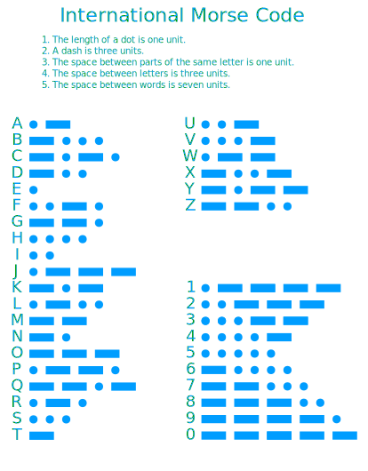

Microbit Morse Code
===================

A script that allows you to send morse code between two microbits.

Usage
-----

See the morse code chart below for help:

In the above diagram:
* The dots · represent short signals.
* The dashes - represent long signals.

1. Button **A** is a short signal.
2. Button **B** is a long signal.
3. Begin by typing out a letter using the **A** and **B** buttons.
4. When you are done, press **A** and **B** at the same time. This will add the letter to the current string waiting to be sent.
5. To send the current string, type the *end* character by typing **ABAB**. This will send the string to all other microbits on the radio frequency.

Note: pressing **A** and **B** at the same time with nothing typed will add the previous letter to the string waiting to be sent.

Links
-----

* [GitLab](https://gitlab.com/shdima/microbit-morse-code)
* [GitHub](https://github.com/sh-dima/microbit-morse-code)

License
-------

© 2024-2025 [Дима Ш.](https://gitlab.com/shdima)

[Microbit Morse Code](./) is licensed under the [AGPL 3.0](./LICENSE) only.
